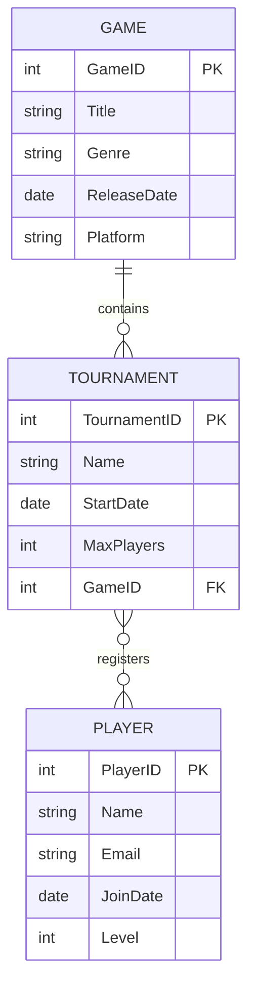

# Game Tournament Management API

A Spring Boot RESTful API for managing Players, Games, and Tournaments.

The application provides full CRUD functionality for each entity and demonstrates the use of Spring Security, HATEOAS, and design patterns such as Factory and Repository.

---

## 📌 Project Overview

This project was developed as a demonstration of REST API development principles using Spring Boot.

The application allows administrators to manage:

- Players
- Tournaments
- Games

The API follows RESTful principles and includes:

- Full CRUD functionality for each entity
- DTO-based architecture for separation of concerns
- Basic login form and role-based access using Spring Security
- HATEOAS implemented for the Player entity
- Swagger/OpenAPI documentation for easy API exploration

---

## 🚀 Features

- CRUD operations for Players, Tournaments, and Games
- Many-to-many relationship between Players and Tournaments
- Many-to-one relationship between Tournaments and Games
- Basic login form with role-based access control
- HATEOAS implemented for the Player resource
- Swagger documentation for all API endpoints
- DTO-based architecture to avoid exposing entities directly

---

## ⚙️ Technologies Used

| Technology       | Purpose                                |
|------------------|----------------------------------------|
| Java 17+         | Programming Language                   |
| Spring Boot      | Backend Framework                      |
| Spring Web       | REST API Development                   |
| Spring Data JPA  | Database Access                        |
| H2               | Database                               |
| Maven            | Dependency Management                  |
| Swagger/OpenAPI  | API Documentation                      |
| Spring Security  | Authentication & Authorization         |
| DTO Architecture | Decoupling Entities from API Responses |

---

## 🔐 Security

The API uses Spring Security with a basic login form.

- Only authenticated users with the `ADMIN` role can access the endpoints
- Passwords are encoded using Bcrypt.

---

## 🔗 HATEOAS

HATEOAS was implemented for the Player entity.

Example links included:

- `self` link for the player resource
- `allPlayers` link to list all players

---

## 🏗️ Design Patterns

### Repository Pattern

Spring Data JPA repositories are used to abstract database access and provide CRUD functionality.

### Factory Pattern

A Player Factory is used to centralise object creation and enforce validation rules during entity creation.

### Singleton Pattern

Spring-managed beans such as services, repositories, and controllers use the default singleton scope provided by the Spring Framework.

---

## 🚀 How to Run the Project

### Prerequisites

- Java 17+
- Maven
- H2

### Steps

```text
git clone https://github.com/e-t-duncan/Game_Management.git
Once cloned run ApiProjectApplication
http://localhost:8091/swagger-ui/index.html

```

---

## 📖 API Documentation

Swagger UI is available at:

```text
http://localhost:8091/swagger-ui/index.html
```

---

## 🔑 Default Login

```text
Username: Admin
Password: password
```

---

## 📂 Project Structure

```text
src/main/java
├── config
├── controller
├── dto
├── modelAssembler
├── repository
├── service
├── entity
└── webController
```

## 🔮 Future Improvements

- Extend HATEOAS support to Games and Tournaments
- Improve validation and exception handling
- Develop a thymeleaf view

